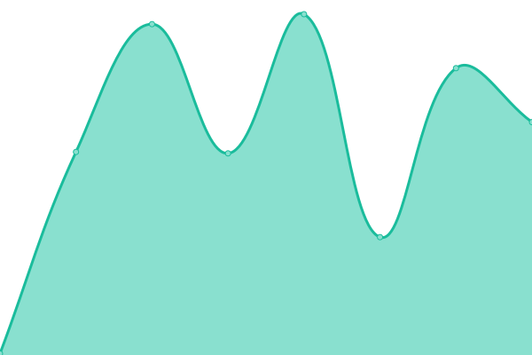
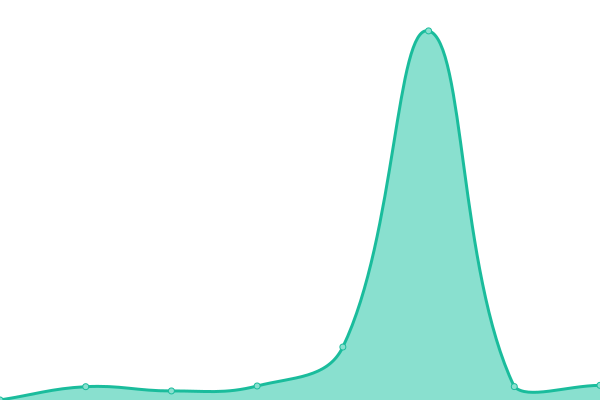
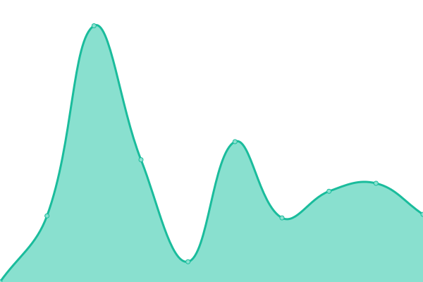

# [📈 Live Status](https://NiftyValue.github.io/monitoring): <!--live status--> **🟧 Partial outage**

This repository contains the open-source uptime monitor and status page for [NiftyValue](https://NiftyValue.github.io/monitoring), powered by [Upptime](https://github.com/upptime/upptime).

With [Upptime](https://upptime.js.org), you can get your own unlimited and free uptime monitor and status page, powered entirely by a GitHub repository. We use [Issues](https://github.com/NiftyValue/monitoring/issues) as incident reports, [Actions](https://github.com/NiftyValue/monitoring/actions) as uptime monitors, and [Pages](https://NiftyValue.github.io/monitoring) for the status page.

<!--start: status pages-->
<!-- This summary is generated by Upptime (https://github.com/upptime/upptime) -->
<!-- Do not edit this manually, your changes will be overwritten -->
<!-- prettier-ignore -->
| URL | Status | History | Response Time | Uptime |
| --- | ------ | ------- | ------------- | ------ |
|  [Frontend](https://app.niftyvalue.com) | 🟩 Up | [frontend.yml](https://github.com/NiftyValue/monitoring/commits/HEAD/history/frontend.yml) | 

 1482ms
     
 | 

<a href="https://NiftyValue.github.io/monitoring/history/frontend">100.00%</a>
    

|  [GraphQL API](https://staging.gql.api.niftyvalue.com/v1/graphql) | 🟥 Down | [graph-ql-api.yml](https://github.com/NiftyValue/monitoring/commits/HEAD/history/graph-ql-api.yml) | 

 4560ms
     
 | 

<a href="https://NiftyValue.github.io/monitoring/history/graph-ql-api">94.22%</a>
    

|  [Discovery API](https://artdiscovery.api.niftyvalue.com/recs/api/v1.0/recs?artworks_pos=11,92&artworks_neg=7152) | 🟩 Up | [discovery-api.yml](https://github.com/NiftyValue/monitoring/commits/HEAD/history/discovery-api.yml) | 

 7715ms
     
 | 

<a href="https://NiftyValue.github.io/monitoring/history/discovery-api">99.56%</a>
    

|  [Valuation API](https://artvaluation.api.niftyvalue.com/price/api/v1.0/predictions?tokens=2,29) | 🟩 Up | [valuation-api.yml](https://github.com/NiftyValue/monitoring/commits/HEAD/history/valuation-api.yml) | 

 2825ms
     
 | 

<a href="https://NiftyValue.github.io/monitoring/history/valuation-api">99.61%</a>
    

<!--end: status pages-->

[**Visit our status website →**](https://NiftyValue.github.io/monitoring)

## 📄 License

- Powered by: [Upptime](https://github.com/upptime/upptime)
- Code: [MIT](./LICENSE) © [NiftyValue](https://NiftyValue.github.io/monitoring)
- Data in the `./history` directory: [Open Database License](https://opendatacommons.org/licenses/odbl/1-0/)
